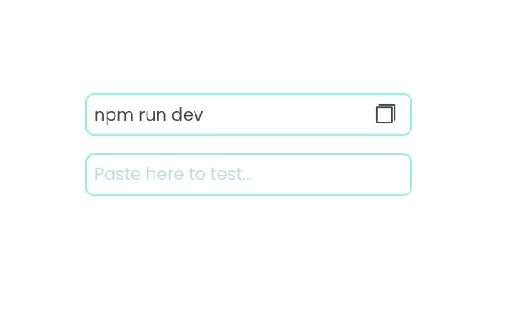

# Copy to Clipboard

> A simple case study about how to create an copy to clipboard button using HTML, CSS and JavaScript.

## How?

When the button is clicked, the text inside the content is saved inside the `text` variable, and then that content is placed inside the `writeText` method.

```js
const button = document.querySelector('#copy-to-clipboard');
const paragraph = document.querySelector('.text-content');

button.addEventListener('click', () => {
  const text = paragraph.innerHTML.trim();

  navigator.clipboard.writeText(text);
});
```

The Clipboard interface's writeText() property writes the specified text string to the system clipboard.

```js
navigator.clipboard.writeText("Text To Save in Clipboard");
```

## Preview

<div align='center'>



</div>

## Techs

- HTML
- CSS
- JavaScript
- [Phosphor Icons](https://phosphoricons.com/)
- [Font Poppins](https://fonts.google.com/specimen/Poppins?query=poppins)